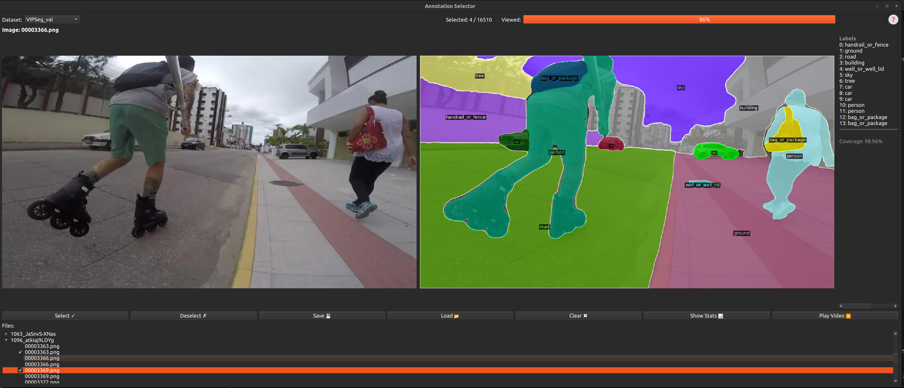

# Annotation Selector

A graphical user interface (GUI) tool designed for viewing, navigating, and selecting images from panoptic segmentation datasets. It provides a set of features to streamline the process of curating image subsets for image and video panoptic segmentation tasks.


Here's what the Annotation Selector looks like in action:



## 🛠️ TODO

- [x] Increase dataset support (added VIPSeg, COCONut, ADE20K)
- [ ] ❗ Update installation procedures (below raw version)


## ✨ Features

- **Multi-Dataset Support**: Switch between VIPSeg, COCONut, ADE20K, and more.
- **Side-by-Side Viewer**: View original images and panoptic masks together.
- **Quick Navigation**: Use arrow keys or file list to browse images.
- **Flexible Selection**: Select/deselect images via checkboxes or shortcuts.
- **Mask Inspection**: Click a class label to view its segment.
- **Video Support**: Automatically handles video datasets with frame grouping.
- **Save & Load Selections**: Export/import selected image lists (JSON).
- **Stats Dashboard**: Compare subset vs. full dataset stats.
- **Help Menu**: Use the `?` icon for more shortcuts and usage tips.


## ⚙️ Environment Setup

Follow these steps to get started:

### 1. Create a Conda Environment

```bash
conda create -n ann_sel python=3.10 -y
conda activate ann_sel
```

### 2. Install [Detectron2](https://github.com/facebookresearch/detectron2)

### 3. Install Other Dependencies

```bash
conda install numpy matplotlib pillow -y
pip install tqdm
pip install PyQt6
pip install git+https://github.com/cocodataset/panopticapi.git
pip install opencv-python-headless
```
## 📁 Dataset Preparation

The tool supports multiple datasets. You must define their paths using a `config.json` file in the project root.

### 1. Download the Dataset

The tool supports multiple panoptic segmentation datasets. Use the links below to prepare each one:

- **VIPSeg**  
  🔹 [Download and setup instructions](https://github.com/VIPSeg-Dataset/VIPSeg-Dataset)

- **COCONut (CVPR 2024)**  
  🔹 [Preparation guide from ByteDance](https://github.com/bytedance/coconut_cvpr2024/blob/main/preparing_datasets.md)

- **ADE20K (Panoptic)**  
  🔹 [Instructions via MMDetection](https://github.com/open-mmlab/mmdetection/blob/main/docs/en/user_guides/dataset_prepare.md#ade20k)

Each dataset should be configured in `config.json` with valid paths to `image_dir`, `mask_dir`, and `ann_file` as below.

### 2. Configure Dataset Paths

Create a `config.json` file in the root directory of the project to define paths to the dataset files.

Example `config.json`:

```json
{
    "datasets": {
        "VIPSeg_val": {
            "image_dir": "/path/to/VIPSeg/VIPSeg_720P/images",
            "mask_dir": "/path/to/VIPSeg/VIPSeg_720P/panomasksRGB",
            "ann_file": "/path/to/VIPSeg/VIPSeg_720P/panoptic_gt_VIPSeg_val.json"
        }, 
        "VIPSeg_train": {
            "image_dir": "/path/to/VIPSeg/VIPSeg_720P/images",
            "ann_file": "/path/to/VIPSeg/VIPSeg_720P/panoptic_gt_VIPSeg_train.json",
            "mask_dir": "/path/to/VIPSeg/VIPSeg_720P/panomasksRGB"
        }, 
        "COCONut_val": {
            "image_dir": "/path/to/val2017",
            "ann_file": "/path/to/relabeled_coco_val.json",
            "mask_dir": "/path/to/relabeled_coco_val"
        }, 
        "COCONut_train": {
            "image_dir": "/path/to/train2017",
            "ann_file": "/path/to/coconut_s.json",
            "mask_dir": "/path/to/coconut_s"
        }, 
        "ADE20K_pan_val": {
            "image_dir": "/path/toADEChallengeData2016/images/validation",
            "ann_file": "/path/toADEChallengeData2016/ade20k_panoptic_val.json",
            "mask_dir": "/path/toADEChallengeData2016/ade20k_panoptic_val"
        },
        "ADE20K_pan_train": {
            "image_dir": "/path/toADEChallengeData2016/images/training",
            "ann_file": "/path/toADEChallengeData2016/ade20k_panoptic_train.json",
            "mask_dir": "/path/toADEChallengeData2016/ade20k_panoptic_train" 
        }
    }
}
```

### How to Run

After setting up your environment and configuring paths:

```bash
# Activate the conda environment
conda activate ann_sel

# Launch the main application
python main.py
```

## 📤 Export Selected Annotations

After running the main application, your image selections will be saved automatically to a JSON file in the `selected_annotations/` folder —  
for example: `selected_annotations/selected_coconut_val.json`.


```json
[
  "000000000139.png",
  "000000000285.png",
  "000000000632.png"
]
```

A script named `extract_anns.py` is included to help extract selected annotations for further use or inspection.

### Output Structure

You can run `python extract_anns.py` to export the selected samples for each dataset.
The result will be a subfolder for each dataset (e.g. `exports/COCONut/`) with the current selection of images. 
Each image folder contains: a copy of the original image, a version with panoptic masks overlaid and a labels.txt file with the class names present in the image. 

```
exports/
└── coconut_val/
    ├── 000000000139/
    │   ├── original.jpg
    │   ├── overlay.png
    │   └── labels.txt
    ├── 000000000285/
    └── ...
```

This allows you to easily export, verify, and use selected subsets of your dataset outside the GUI.